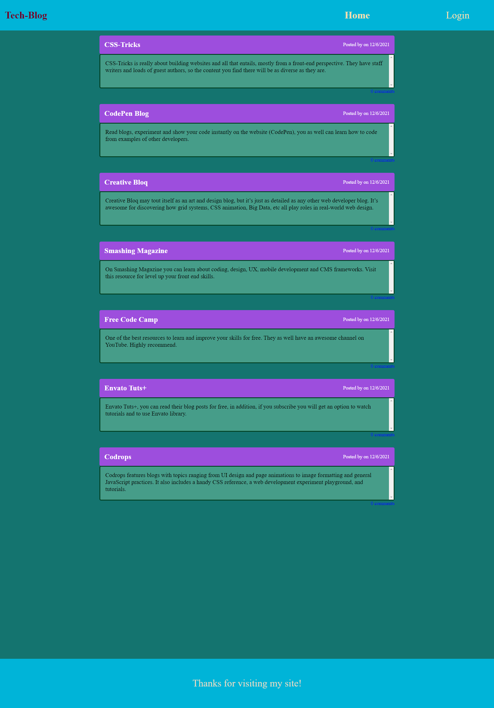

# 🧮 Developer's_Tech_Blog

## ✍️ User Story

---

```md
As a developer who writes about tech
I WANT: a CMS-style blog site
SO THAT: I can publish
articles, blog posts, and my
thoughts and opinions.
```

## 🤝 Acceptance Criteria

---

```md
GIVEN a CMS-style blog site
WHEN: I visit the site for
the first time
THEN: I am presented with the
homepage, which includes existing blog posts if any have been posted; navigation links for the homepage and the dashboard; and the option to log in.
WHEN: I click on the homepage
option
THEN: I am taken to the
homepage.
WHEN: I click on any other
links in the navigation
THEN: I am prompted to either
sign up or sign in.
WHEN: I choose to sign up
THEN: I am prompted to create
a username and password.
WHEN: I click on the sign-up
button
THEN: my user credentials are
saved and I am logged into the site.
WHEN: I revisit the site at a
later time and choose to sign in.
THEN: I am prompted to enter
my username and password.
WHEN: I am signed in to the
site
THEN: I see navigation links
for the homepage, the dashboard, and
the option to log out.
WHEN: I click on the homepage
option in the navigation
THEN: I am taken to the
homepage and presented with existing
blog posts that include the post
title and the date created.
WHEN: I click on an existing
blog post
THEN: I am presented with the
post title, contents, post creator’s
username, and date created for that
post and have the option to leave a
comment.
WHEN: I enter a comment and click on the submit button while signed in
THEN: the comment is saved and the post is updated to display the comment, the comment creator’s username, and the date created
WHEN: I click on the dashboard option in the navigation
THEN: I am taken to the dashboard and presented with any blog posts I have already created and the option to add a new blog post
WHEN: I click on the button to add a new blog post
THEN: I am prompted to enter both a title and contents for my blog post
WHEN: I click on the button to create a new blog post
THEN: the title and contents of my post are saved and I am taken back to an updated dashboard with my new blog post
WHEN: I click on one of my existing posts in the dashboard
THEN: I am able to delete or update my post and taken back to an updated dashboard
WHEN: I click on the logout option in the navigation
THEN: I am signed out of the site
WHEN: I am idle on the site for more than a set time
THEN: I am able to view comments but I am prompted to log in again before I can add, update, or delete comments
```

---

## 🖼️ Mock-Up

---

The following animation demonstrates the application functionality:


---

## 🏃‍♂️ Getting Started

---

The application’s folder structure must follow the Model-View-Controller paradigm. You need to use the [express-handlebars](https://www.npmjs.com/package/express-handlebars) package to implement Handlebars.js for your views, use the [MySQL2](https://www.npmjs.com/package/mysql2) and [Sequelize](https://www.npmjs.com/package/sequelize) packages to connect to a MySQL database for your Models, and create an Express.js API for your Controllers.

You also need the [dotenv package](https://www.npmjs.com/package/dotenv) to use environment variables, the [bcrypt package](https://www.npmjs.com/package/bcrypt) to hash passwords, and the [express-session](https://www.npmjs.com/package/express-session) and [connect-session-sequelize](https://www.npmjs.com/package/connect-session-sequelize) packages to add authentication.

**Note**: The [express-session](https://www.npmjs.com/package/express-session) package stores the session data on the client in a cookie. When you are idle on the site for more than a set time, the cookie will expire and you will be required to log in again to start a new session. This is the default behavior and you do not have to do anything to your application other than implement the npm package.

---

## 💾 Installation & Usage

---

To install this application, clone the repository to your local directory by using following link:

- https://github.com/Amit-Ranjan22/Developers_Tech_Blog.git

Once downloaded, you can install its dependencies by navigating to the Developers_Tech_Blog directory on your local machine and issuing the following command:

- npm install

This command will install the following dependencies:

- bcrypt
- connect-session-sequelize
- dotenv
- express
- express-handlebars
- express-session
- handlebars
- mysql2
- sequelize

After installing all the dependencies, from your terminal, log into mysql by using

- mysql -u root -p

and enter your password for mysql.
Once you are logged in to your mysql, run the schema by using

- source db/schema.sql;

Once you run the schema, come out of mysql by using

- exit

Now, from your terminal run your seed file by using

- npm run seed

After seeding your database run your server.js file by using

- node server.js

---

## 🧪 Tests

---

```
There are no test used for this application.
```

---

## 🖼️ Deployed Application Screenshot

---

The following image is the screenshot of the deployed application:



---

## 🔌 Link to the deployed application on Heroku

---

- Heroku Link: [Developers_Tech_Blog]()

---

## 🔌 Link to the Git-Hub repository

---

- GitHub Link: [
  https://github.com/Amit-Ranjan22/Developers_Tech_Blog.git)

---

<h2 id='contribution'>🧑‍🤝‍🧑 Contribution</h2>

    Amitabh Ranjan

---

<h2 id='questions'>❓ Questions</h2>

<h3>For any question you can reach me at:</h3>

---

<h3>😺GitHub: <a href='https://github.com/Amit-Ranjan22'>Amit-Ranjan22</a></h3>

<h3>📩 Email: <a href='https://mail.google.com/'>amitabh.march22@gmail</a></h3>

---

## ©️ License & Copyright

Licensed under the [MIT License](License-Copyright/LICENSE).
